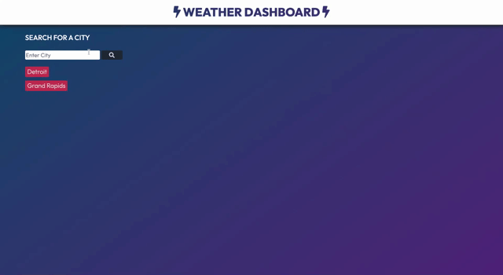

# Weather Dashboard - Homework # 6
## Project Description 
Website application that is designed to retrieve weather data from the OpenWeather API and display the results for a specified city. 

### Built With 
- HTML
- CSS 
- Javascript
- JQuery
- Moment.JS
- Favorite Icon
- Google Fonts 
- Bootstrap 

### Files & Directories 
- index.html
- style.css
- script.js 

## Example of Functionality 

## Instructions 
1. Fork and clone repository
2. Create directory under /develop
3. Add static content to /develop
4. Commit changes to repository
5. Deploy repository to hosting service

## Checkout the Live Version of the Site
[Weather Dashboard](https://ashleyviola.github.io/weather-dashboard/)

## Editor Information 
Created and maintained by Ashley Viola 
